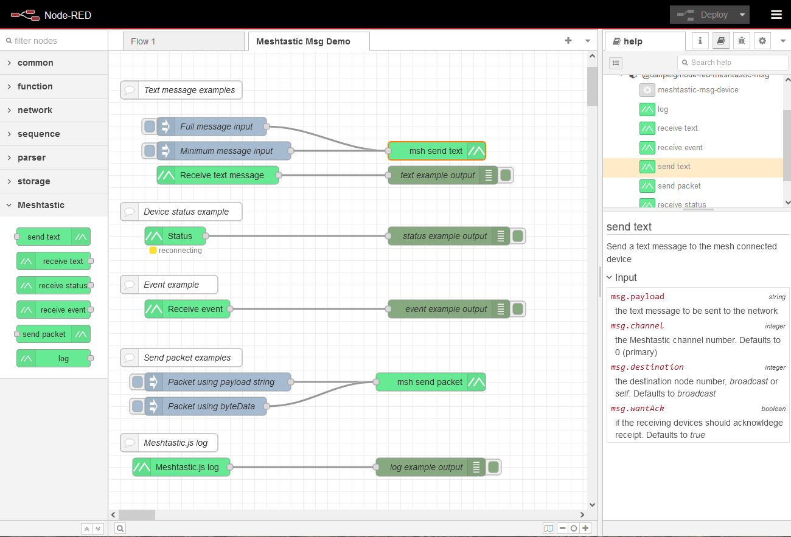

# Node-RED Meshtastic messages node

This node allows sending and receiving packets to a Meshtastic mesh network thru a device connected via HTTP(S) or serial. It is based on [Meshtastic Web](https://github.com/meshtastic/web) library.

## Features
- Send and receive text messages to/from any device in the mesh
- Supervise/monitor device status
- Subscribe and receive all types of events supported by [Meshtastic Web](https://github.com/meshtastic/web) (examples: Atak, Position, Range Test, Map Report, Store and Forward, etc...)
- Send packets to any Meshtastic APP (port num)
- Plug and Play: no additional servers, no containers, no CLI, no binary files
- Indirect support to MQTT via uplink/downlink channels
- Supported connection modes: HTTP, HTTPS (TLS) and Serial
- Can connect to multiple Meshtastic devices simultaneously

## Limitations
- Connect directly to MQTT server: this is not supported by [Meshtastic Web](https://github.com/meshtastic/web)
- Connect to a device via Bluetooth: Not supported by [Meshtastic Web](https://github.com/meshtastic/web)

## Automatic installation (recommended)

From Node-RED palette manager, search for the package `@danpeig/node-red-meshtastic-msg` in the community library or NPM.

## Manual installation

1. Place the project files inside a folder called `node-red-meshtastic-msg` inside the Node-RED base directory (where the `settings.js` file is located)
2. Run `npm install ./node-red-meshtastic-msg`
3. Edit `meshtastic-msg.js` and change the relative path of the Meshtastic library according to the existing directory structure. Example: `importSync("../node_modules/@meshtastic/js/dist/index.js")`.

To uninstall, run `npm remove @danpeig/node-red-meshtastic-msg` from the same base directory.

## Known issues and troubleshooting

- Failed installation: Depending on the installation method, you may have to edit the file `meshtastic-msg.js` and change the path of the ImportSync to the location where Meshtastic library was installed. Example: `importSync("../../@meshtastic/js/dist/index.js")`.
- Device is connecting and can send messages but not receive: Device can be overloaded with requests, try increasing the fetch interval.

## Examples

An example flow with the acceptable input message formats can be found in the `examples` sub-directory.

## BONUS for developers - Meshtastic Web fundamentals boilerplate

The `fundamentals_meshtastic_web.mjs` illustrates how to use [Meshtastic Web](https://github.com/meshtastic/web) library from plain NodeJS Javascript (No TypeScript, no React, no compilation, no nothing).

## License

This node was created by [Daniel BP](http://www.danbp.org) and is available under the MIT license.

## Version history
- **3.0 (06/11/2025)**
    - [Meshtastic Web](https://github.com/meshtastic/web) library version **2.6.7**
    - Tested/validated with the following versions of the device firmware: **2.6.11**
    - Added support for serial connections
    - Fixed connection issues when more than one Meshtastic device is used at the same time
    - Renamed and updated the Meshtastic Web fundamentals example, `fundamentals_meshtastic_web.mjs` (bonus for developers)
    - Updated README and instructions
- **2.0 (02/11/2025)**
    - Migrated from the deprecated Meshtastic.js to the all new [Meshtastic Web](https://github.com/meshtastic/web) library
    - [Meshtastic Web](https://github.com/meshtastic/web) library version **2.6.7**
    - New log level setting in the device connection configuration
    - Custom `.npmrc`is no longer required
    - Tested/validated with the following versions of the device firmware: **2.6.11**
    - Renamed example file
    - Improved error handling and debug messages
    - Improved the `experiments_meshtastic.js`
    - Handlers for the following events: `onAtakPacket, onDeviceMetadataPacket, onCannedMessageModulePacket, onAudioPacket,  onAtakPluginPacket, onAtakForwarderPacket,  onClientNotificationPacket`
    - Updated the instructions
- **1.7 (18/05/2025)**
    - Updated `@meshtastic/js` version to **2.6.0-0**: this should fix some loop and HTTP connection errors.
	- Updated README.md based on user frequent questions.
    - Tested/validated with the following versions of the device firmware: **2.5.18** and **2.6.4**.
	- Tested/validated with the following version of Node-RED: 4.0.9 (docker)
- **1.6 (27/01/2025)**
    - Updated `@meshtastic/js` version to **2.5.9-3**: this should fix some loop and HTTP connection errors.
	- Updated README.md based on user frequent questions.
    - Tested/validated with the following version of the device firmware: **2.5.18.9**.
	- Tested/validated with the following version of Node-RED: 4.0.8 (docker)
- **1.5 (13/11/2024)**
    - Updated `@meshtastic/js` version to **2.5.9-2**. This should fix protobuf decoding errors with the latest device firmware.
    - Tested/validated with the following version of the device firmware: **2.5.11**.
- **1.4 (21/09/2024)**
    - Updated dependency versions
- **1.3 (30/07/2024)**
    - Added Meshtastic.js log node
- **1.2 (29/07/2024)**
    - Improved documentation
    - Meshtastic visual identity
    - Improved NPM descriptions 
- **1.1 (28/07/2024)**
    - Fixed path to the Meshtastic library when installed from NPM
- **1.0 (28/07/2024)**
    - Initial release     

----
# Node reference guide

This information can also be found in the specific node help pages, directly from Node-RED interface.

## Send text node
Send a text message to the mesh connected device

### Input
- `msg.payload` (string) :  the text message to be sent to the network
- `[msg.channel]` (integer):  the Meshtastic channel number. Defaults to *0* (primary)
- `[msg.destination]` (integer):  the destination node number, *broadcast* or *self*. Defaults *broadcast*
- `[msg.wantAck]` (boolean):  if the receiving devices should acknowldege receipt. Defaults to *true*

[] = optional fields

## Receive text node
Receive a text message from the mesh connected device

### Outputs
- `msg` (json) : object with all package properties
- `msg.payload` (string): text content of the message 

## Receive status node
Receive the status code of the Meshtastic device
    
### Outputs
    
- `msg.payload` (integer): status code of the device

## Receive event node
This node will watch for the defined event and output the payload received.
Typically, the output should be a JSON field but there are some events that report numbers or simple strings. Events are defined in the [eventSystem.ts](https://github.com/meshtastic/web/blob/main/packages/core/src/utils/eventSystem.ts) file from Meshtastic Web.

### Settings
- `event` (string): select the event to monitor/watch

### Outputs
- `msg` (json): data from the event

## Send packet node
Send a packet to the mesh connected device.
Input packet can be either in the string format (*msg.payload*) or Uint8Array (*msg.byteData*) format.

### Input

- `msg.payload` (string): Will be converted to Uint8Array and used if *byteData* field is not set
- `[msg.byteData]` (json) : Data properly encoded as Uint8Array. If set, will be used instead of *payload*. Example *[72, 101, 108, 108, 111, 32, 119, 111, 114, 108, 100, 33]*
- `[msg.portNum]` (integer): Application number. Defaults to *1* (text messsage app).
- `[msg.destination]` (integer string): Destination node number, *broadcast* or *self*. Detaults to *broadcast*
- `[msg.channel]` (integer): Channel number, defaults to *0* (primary channel)
- `[msg.wantAck]` (boolean):  Confirmation, defaults to *true*
- `[msg.wantResponse]` (boolean): Defaults to *false*
- `[msg.echoResponse]` (boolean): Defaults to *false*
- `[msg.replyId]` (integer): Defaults to *null*
- `[msg.emoji]` (integer): Defaults to *null*

[] = optional fields

## Receive Meshtastic.js log node

Output the log from [Mesthastic.js](https://js.meshtastic.org) library. Usefull for debug purposes and connection status info.
**Note:** This is not Node-RED log neither the Lora device log.

### Outputs

- `msg` (json) : object with all log message properties
- `msg.payload` (string): text content of the log entry (fields \[0\] and \[1\] concatenated) 

## Device configuration node
This will setup the connection to the Meshtastic node.
The connection protocol can be HTTP, HTTPS or Serial. Bluetooth or MQTT are not supported yet.

### Options
* `Connection mode`: Select the type of the connection. Default is *http*.
* `IP, hostname or device` (string) : IP address, hostname or device of the Meshtastic radio to connect. Examples: *192.168.0.15*, *meshtastic.local*, */dev/ttyUSB0*
* `Fetch interval` (integer): Interval between polling data from the device. Default is *5000ms*.
* `Log level` (integer): Default is *3*. Recommended for production is *5*
  - 0: everything
  - 1: trace
  - 2: debug
  - 3: info
  - 4: warn
  - 5: error
  - 6: fatal
